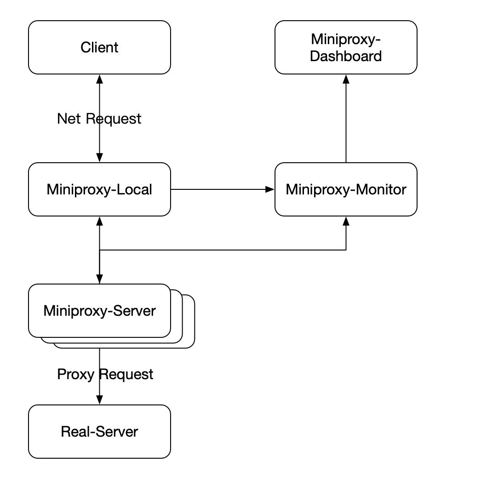

# 代理服务客户端
## 概念
- 每个连接代表一个客户端请求
- 客户端针对一个业务发送的请求表示一个会话session
 

## 需求
- 实现跨GFW的网络代理服务
  - 支持http和https协议
  - 支持其他应用协议，实现视频和语音的传输
- 实现对客户端配置需求最小化
  - 极致减少对用户不必要的操作干扰
  - 用户在无感知的情况下完成服务实现
- 实现用户信息安全的最大化
  - 避免用户痕迹的留存
  - 最大保证用户访问的信息安全

## 设计方案
### PAC文件

* 构建自定义的pac文件

pac文件用来实现浏览器或操作系统的请求转发

### 架构介绍

 
### 功能组件
Miniproxy包括数据平面和控制平面的多个组件
- 数据平面
    - Miniproxy Local 本地客户端
    - Miniproxy Server 转发服务端
- 控制平面
    - [Dashboard] 为用户提供图形化控制界面和监控界面

### 代理服务客户端执行流程
1. 客户端应用发起网络请求
2. 请求通过代理域名判断，需要走代理的走代理服务，不需要走代理的直接发起请求
3. 请求以Socks5协议转发到代理服务客户端
4. 本地代理服务将请求的域名和数据读取出来，将数据部分加密通过与服务端之间的连接转发出去
5. 本地代理服务等待代理服务服务端的应答数据
6. 客户端收到应答数据并解密应答数据
7. 应答数据被转发给客户端

### 代理服务客户端内部逻辑
- 设置配置项
- 初始化配置实例
- 处理配置参数
- 实例化服务
- 启动服务
- 循环等待请求
- 接收请求
 - 创建读取循环协程
 - 创建写入循环协程
- 读取请求的数据部分和请求头部分，并将请求数据加密转发给服务端
- 读取协程等待服务端返回应答数据，将数据解密后通过channel写入客户端连接socket

### 模块化
  - 支持多种协议模块
    - HTTPS
    - Socks5 （优先）
  - 支持多种加密算法
    - AES-256
  - 多种环境配置
    - 客户端
    - 服务端
  - 日志模块
    - 独立日志模块
    

### 客户端和服务端连接
#### 两种实现
- 连接池    （升级迭代）
- 每次新建连接 （初期）

#### 连接池的好处
- 减少了中间连接环节的延迟
- 连接资源的复用，避免无效资源占用

#### 连接池的坏处
- 额外的开发成本

#### 每次新建连接的好处
- 开发成本低

   

# 代理服务服务端
#### 服务端代理服务内部逻辑 
- 设置配置项
- 初始化配置实例
- 处理配置参数
- 实例化服务
- 启动服务
- 循环等待请求
- 接收请求
 - 创建读取循环协程
 - 创建写入循环协程
- 读取请求的数据部分和请求头部分，解密请求体，通过请求体解析外部请求资源
- 建立到外部的连接，通过连接转发请求体给对方，等待对方应答
- 收到应答数据，将应答数据加密通过channel通知写入客户端请求socket

